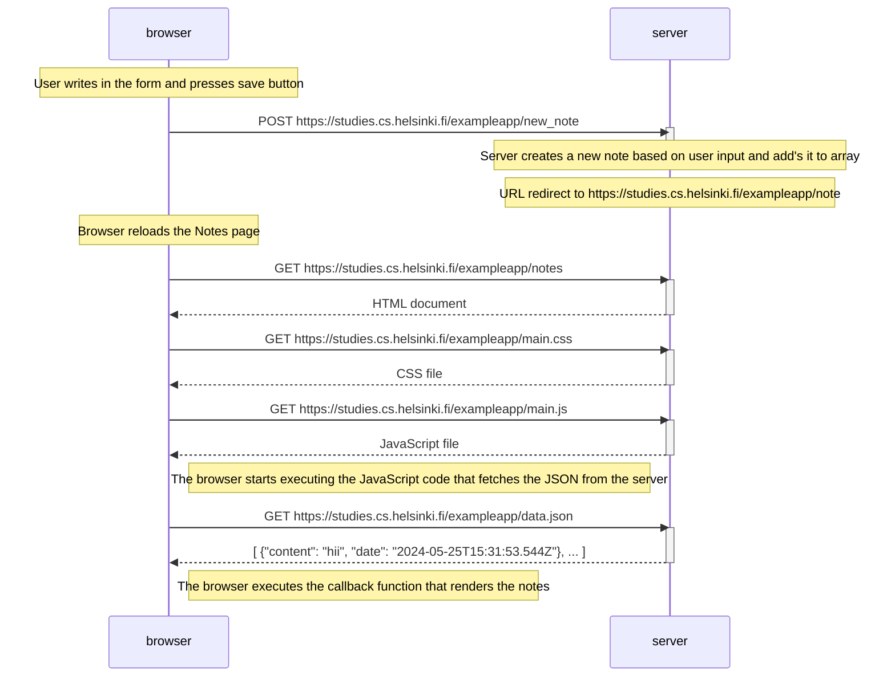

```mermaid
sequenceDiagram
    participant browser
    participant server
    
    note over browser: User writes in the form and presses save button

    browser->>server: POST https://studies.cs.helsinki.fi/exampleapp/new_note
    activate server
    deactivate server
    note over server: Server creates a new note based on user input and add's it to array 
    note over server: URL redirect to https://studies.cs.helsinki.fi/exampleapp/note

    note over browser: Browser reloads the Notes page
    browser->>server: GET https://studies.cs.helsinki.fi/exampleapp/notes
    activate server
    server-->>browser: HTML document
    deactivate server

    browser->>server: GET https://studies.cs.helsinki.fi/exampleapp/main.css
    activate server
    server-->>browser: CSS file
    deactivate server

    browser->>server: GET https://studies.cs.helsinki.fi/exampleapp/main.js
    activate server
    server-->>browser: JavaScript file
    deactivate server

    Note right of browser: The browser starts executing the JavaScript code that fetches the JSON from the server

    browser->>server: GET https://studies.cs.helsinki.fi/exampleapp/data.json
    activate server
    server-->>browser: [    {"content": "hii", "date": "2024-05-25T15:31:53.544Z"}, ... ]
    deactivate server

     Note right of browser: The browser executes the callback function that renders the notes
```