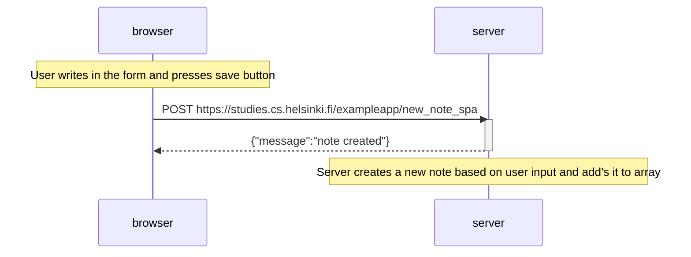

```mermaid
sequenceDiagram
    participant browser
    participant server
    
    note over browser: User writes in the form and presses save button

    browser->>server: POST https://studies.cs.helsinki.fi/exampleapp/new_note_spa
    activate server
    server-->>browser: {"message":"note created"}
    deactivate server
    note over server: Server creates a new note based on user input and add's it to array 
```